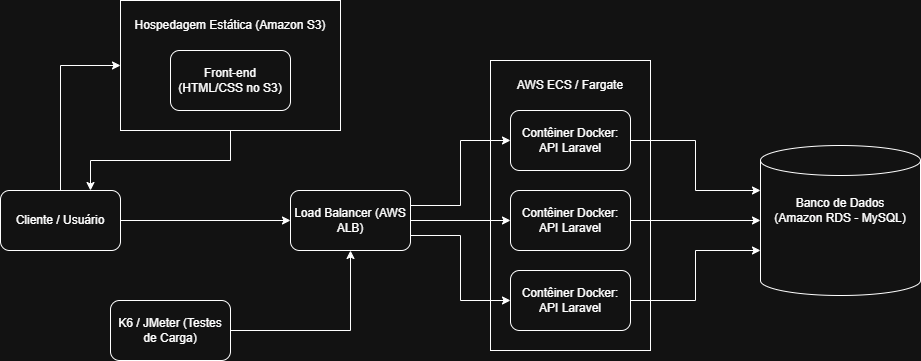

# ☁️ Modelagem e Avaliação de Arquitetura de Software para Sistemas Web Escaláveis

## 📖 Descrição da Proposta
Este projeto de Iniciação Científica propõe, modela e avalia uma arquitetura de software baseada em microsserviços e computação em nuvem (*cloud-native*) para substituir aplicações monolíticas legadas. O foco da solução é mitigar a degradação de desempenho sob alta carga computacional, utilizando orquestração de contêineres e estratégias de *auto-scaling* para garantir alta disponibilidade e otimização de custos operacionais.

## 🎯 Objetivos
* **Geral:** Modelar, implementar e avaliar uma arquitetura escalável orientada a serviços hospedada na AWS, fornecendo uma base empírica sobre desempenho sob estresse.
* **Específicos:**
  * Desenhar a arquitetura isolando o *front-end* e conteinerizando o *back-end*;
  * Desenvolver uma Prova de Conceito (PoC) utilizando princípios de infraestrutura como código;
  * Mapear padrões de projeto para sistemas distribuídos;
  * Executar testes empíricos de carga com injeção massiva de tráfego.

## 🛠 Tecnologias Utilizadas
* **Back-end:** PHP 8+ com Framework Laravel (API REST).
* **Front-end:** HTML5, CSS3, JavaScript (Vanilla).
* **Banco de Dados:** MySQL.
* **DevOps & Infraestrutura:** Docker, Docker Compose.
* **Computação em Nuvem (AWS):** Amazon S3, Amazon ECS (Fargate), Application Load Balancer (ALB), Amazon RDS.
* **Testes de Desempenho:** K6 (scripts em JS) ou Apache JMeter.

## ⚙️ Arquitetura da Solução
A arquitetura baseia-se na separação estrita de responsabilidades. O *front-end* é hospedado de forma estática no Amazon S3, enquanto o *back-end* (API Laravel *stateless* autenticada via JWT) é empacotado em contêineres Docker. A orquestração ocorre no Amazon ECS utilizando o modelo *serverless* Fargate, que permite escalabilidade horizontal automática gerenciada por um Load Balancer (ALB). A persistência é isolada de forma segura em uma instância gerenciada do Amazon RDS.

## 📊 Diagrama da Arquitetura

## 📂 Estrutura do Repositório

/data  
  /bruto  
  /tratado  

/diagramas  
  /arquitetura  
  /modelagem  

/docs  
  /apresentacoes  
  /artigos  
  /fichamentos  
  /relatorios  

/referencias  
  /bibtex  
  /pdfs  

/src  
  /experimentos  
  /prototipo  

# Referências Principais

## 1. Fontes Primárias da Área

DRAGONI, Nicola et al. Microservices: yesterday, today, and tomorrow. **Present and ulterior software engineering**, p. 195-216, 2017. Disponível em: https://arxiv.org/pdf/1606.04036. Acesso em: 22 abr. 2026.

FIELDING, Roy T.; TAYLOR, Richard N. Principled design of the modern web architecture. **ACM Transactions on Internet Technology (TOIT)**, v. 2, n. 2, p. 115-150, 2002. Disponível em: https://dl.acm.org/doi/pdf/10.1145/514183.514185. Acesso em: 22 abr. 2026.

KAZMAN, Rick et al. The architecture tradeoff analysis method. In: **Proceedings. fourth ieee international conference on engineering of complex computer systems (cat. no. 98ex193)**. IEEE, 1998. p. 68-78. Disponível em: https://apps.dtic.mil/sti/tr/pdf/ADA350761.pdf. Acesso em: 22 abr. 2026.

PAHL, Claus; JAMSHIDI, Pooyan; ZIMMERMANN, Olaf. Architectural principles for cloud software. **ACM Transactions on Internet Technology (TOIT)**, v. 18, n. 2, p. 1-23, 2018. Disponível em: https://dl.acm.org/doi/pdf/10.1145/3104028. Acesso em: 22 abr. 2026.

---

## 2. Trabalhos Relacionados

AL-DEBAGY, Omar; MARTINEK, Peter. A comparative review of microservices and monolithic architectures. In: **2018 IEEE 18th International Symposium on Computational Intelligence and Informatics (CINTI)**. IEEE, 2018. p. 000149-000154. Disponível em: https://arxiv.org/pdf/1905.07997. Acesso em: 22 abr. 2026.

EISMANN, Simon et al. Serverless applications: Why, when, and how?. **IEEE Software**, v. 38, n. 1, p. 32-39, 2020. Disponível em: https://arxiv.org/pdf/2009.08173. Acesso em: 22 abr. 2026.

HASSELBRING, Wilhelm; STEINACKER, Guido. Microservice architectures for scalability, agility and reliability in e-commerce. In: **2017 IEEE International Conference on Software Architecture Workshops (ICSAW)**. IEEE, 2017. p. 243-246. Disponível em: https://oceanrep.geomar.de/id/eprint/37489/1/ICSA2017paper.pdf. Acesso em: 22 abr. 2026.

HEINRICH, Robert et al. Performance engineering for microservices: research challenges and directions. In: **Proceedings of the 8th ACM/SPEC on International Conference on Performance Engineering Companion**. 2017. p. 223-226. Disponível em: https://dl.acm.org/doi/pdf/10.1145/3053600.3053653. Acesso em: 22 abr. 2026.

VILLAMIZAR, Mario et al. Evaluating the monolithic and the microservice architecture pattern to deploy web applications in the cloud. In: **2015 10th Computing Colombian Conference (10CCC)**. IEEE, 2015. p. 583-590. Disponível em: https://www.researchgate.net/profile/Mario-Villamizar/publication/304317852_Evaluating_the_monolithic_and_the_microservice_architecture_pattern_to_deploy_web_applications_in_the_cloud/links/5b3ad04ca6fdcc8506ea541b/Evaluating-the-monolithic-and-the-microservice-architecture-pattern-to-deploy-web-applications-in-the-cloud.pdf. Acesso em: 22 abr. 2026.

---

## 3. Interseção dentro da Computação

BERNSTEIN, David. Containers and cloud: From LXC to Docker to Kubernetes. **IEEE Cloud Computing**, v. 1, n. 3, p. 81-84, 2014. Disponível em: https://sweet.ua.pt/andre.zuquete/Aulas/AES/20-21/extras/Bernstein14.pdf. Acesso em: 22 abr. 2026.

KRATZKE, Nane; QUINT, Peter-Christian. Understanding cloud-native applications after 10 years of cloud computing-a systematic mapping study. **Journal of Systems and Software**, v. 126, p. 1-16, 2017. Disponível em: https://www.researchgate.net/profile/Nane-Kratzke/publication/312045183_Understanding_Cloud-native_Applications_after_10_Years_of_Cloud_Computing_-_A_Systematic_Mapping_Study/links/588202be4585150dde401522/Understanding-Cloud-native-Applications-after-10-Years-of-Cloud-Computing-A-Systematic-Mapping-Study.pdf. Acesso em: 22 abr. 2026.

LORIDO-BOTRAN, Tania; MIGUEL-ALONSO, Jose; LOZANO, Jose A. A review of auto-scaling techniques for elastic applications in cloud environments. **Journal of Grid Computing**, v. 12, n. 4, p. 559-592, 2014. Disponível em: https://www.researchgate.net/profile/Tania-Lorido-Botran/publication/265611546_A_Review_of_Auto-scaling_Techniques_for_Elastic_Applications_in_Cloud_Environments/links/543cd6f50cf20af5cfbf7a74/A-Review-of-Auto-scaling-Techniques-for-Elastic-Applications-in-Cloud-Environments.pdf. Acesso em: 22 abr. 2026.

TAIBI, Davide; LENARDUZZI, Valentina; PAHL, Claus. Processes, motivations, and issues for migrating to microservices architectures: An empirical investigation. **IEEE Cloud Computing**, v. 4, n. 5, p. 22-32, 2017. Disponível em: https://m3s-cloud.github.io/assets/paper1.pdf. Acesso em: 22 abr. 2026.

WASEEM, Muhammad; LIANG, Peng; SHAHIN, Mojtaba. A systematic mapping study on microservices architecture in devops. **Journal of Systems and Software**, v. 170, p. 110798, 2020. Disponível em: https://arxiv.org/pdf/2008.07729. Acesso em: 22 abr. 2026.

## 👨‍🎓 Autor

- Kevin Payão Reisauskas  
- Instituição: SENAI "Gaspar Ricardo Júnior"  
- Curso: Técnologo em Análise e Desenvolvimento de Sistemas  
